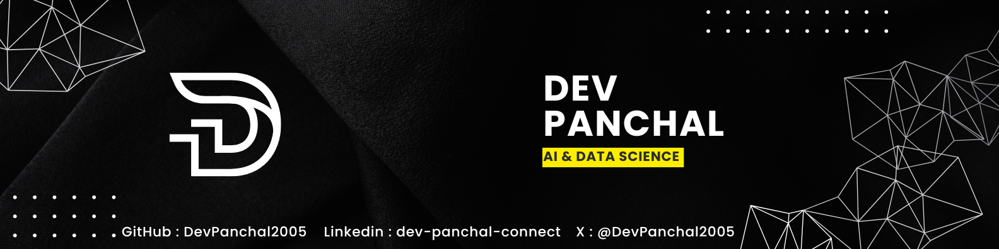

# ✨ Welcome to My GitHub Profile! I'm Dev Panchal

## 📖 About Me

I am an engineering student at **LJ University**, currently pursuing a **Bachelor of Engineering in AI and Data Science** in the Department of Computer Engineering. With a strong passion for artificial intelligence and machine learning, I am dedicated to expanding my knowledge, building innovative projects, and contributing to impactful solutions.

## 🛠️ Technical Skills & Expertise

### **Core Machine Learning & Data Science Skills**

### **Further Profeciences**

#### Programming Languages

### Databases

#### Web Technologies

#### Development Tools & Environments

## 📈 GitHub Stats & Activity

<table>
  <tr>
    <td align="center">
      
    </td>
    <td align="center">
      
    </td>
  </tr>
</table>

## 🔗 Connect & Collaborate

   

## ✨ Let's Create Something Amazing Together!

Feel free to explore my repositories, contribute, or reach out for potential collaborations. I’m always open to connecting with like-minded individuals and contributing to groundbreaking projects!
